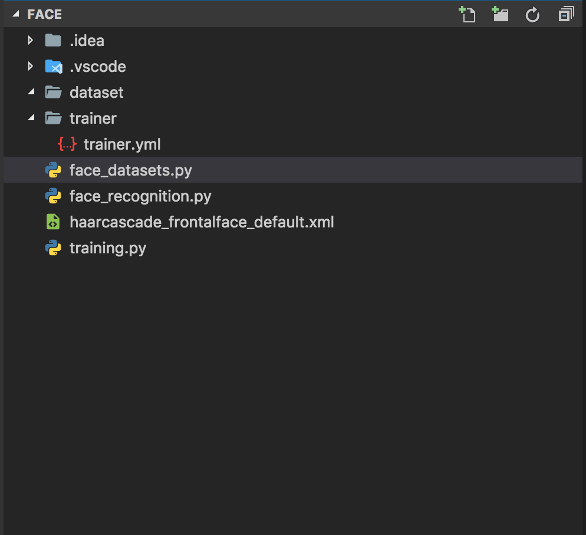

# Opencv-Face-recognition 
face recognition with opencv webcam in python  
-using Cascade Classifier for detection and using face_dataset creator for create custome models and training .yml file
#

#
#
# Face Recognition: Understanding LBPH Algorithm
Human beings perform face recognition automatically every day and practically with no effort.
Although it sounds like a very simple task for us, it has proven to be a complex task for a computer, as it has many variables that can impair the accuracy of the methods, for example: illumination variation, low resolution, occlusion, amongst other.
In computer science, face recognition is basically the task of recognizing a person based on its facial image. It has become very popular in the last two decades, mainly because of the new methods developed and the high quality of the current videos/cameras.
Note that face recognition is different of face detection:
Face Detection: it has the objective of finding the faces (location and size) in an image and probably extract them to be used by the face recognition algorithm.
Face Recognition: with the facial images already extracted, cropped, resized and usually converted to grayscale, the face recognition algorithm is responsible for finding characteristics which best describe the image.
The face recognition systems can operate basically in two modes:
Verification or authentication of a facial image: it basically compares the input facial image with the facial image related to the user which is requiring the authentication. It is basically a 1x1 comparison.
Identification or facial recognition: it basically compares the input facial image with all facial images from a dataset with the aim to find the user that matches that face. It is basically a 1xN comparison.
in this project using LBPH algorithm for recognition face 
## for learning more : 
learn more about LBPH algoritm reading this link in Medium site and more details using wikipedia 
learning more ...  [Medium Page](https://towardsdatascience.com/face-recognition-how-lbph-works-90ec258c3d6b)

##### project Files : 

 * dataset Folder : folder for save dataset of your face 
 * trainer Folder : forder for save traing model output 
 * face_datasets.py : python file for face detection and create picture of face 
 * face_recognition : recognition face with LBPH algorithm 
 * haarcascade_frontalface_default.xml :Haar cascade xml file for face objects and feathers 
 * training : python file for train models 

